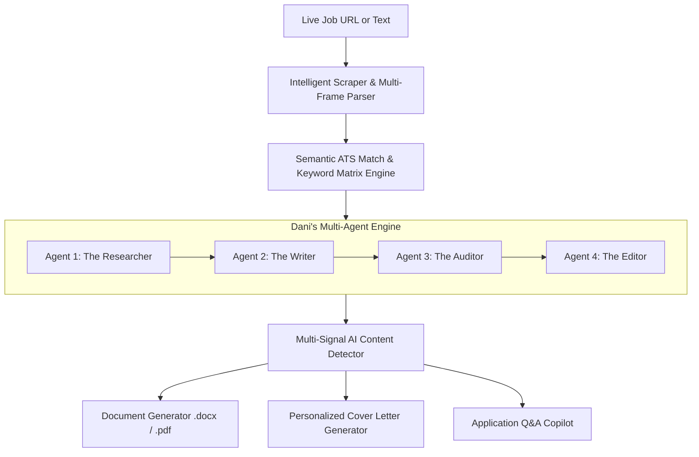
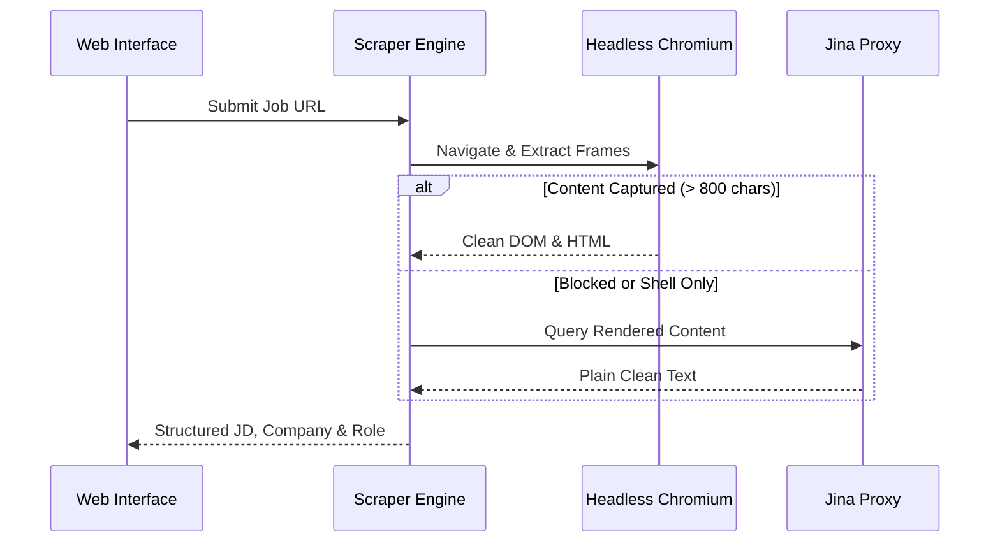
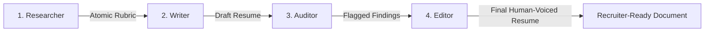

# ATS Agent & Career Copilot
## Autonomous Multi-Agent Career Engineering & ATS Optimization Platform
**Architect & Creator:** M. Adnan Ashfaq  
**Technology Stack:** Python, Flask, Playwright, BeautifulSoup4, Google Gemini GenAI SDK, python-docx, Modern Glassmorphism Web UI

---

## Executive Summary

The modern hiring ecosystem is heavily automated. Over **75% of qualified resumes** are rejected before reaching a human recruiter due to Applicant Tracking System (ATS) filtering (Workday, Greenhouse, Lever, Taleo, Ashby) and shallow keyword matching algorithms. Furthermore, the recent influx of generic ChatGPT-generated resumes has prompted talent teams to deploy AI content detectors.

**ATS Agent & Career Copilot** is a state-of-the-art, multi-agent AI platform that automates the entire end-to-end career workflow. It dynamically ingests any job posting, performs deep semantic gap analysis, deeply weaves required technical frameworks into verified work experience, audits for human voice and AI tells, produces recruiter-clean `.docx` and `.pdf` documents with scrubbed metadata, and answers portal-specific application questions.



---

## 1. The Problem Landscape

| Traditional Job Hunting Challenge | How ATS Agent Solves It |
| :--- | :--- |
| **Manual Tailoring Takes 45+ Minutes Per Job** | Full analysis, tailoring, document generation, and Q&A completed in **under 15 seconds**. |
| **Surface Keyword Stuffing** | Weaves tools directly into **active engineering stories** with concrete metrics instead of just dumping skills. |
| **AI Tells & Detector Flags** | Enforces **Rules 0–16** (Human Voice, rhythmic sentence variation, eliminating cliché openers like *"Spearheaded"*). |
| **Bot-Protected Career Portals** | Multi-frame Playwright scraper with fallback proxies effortlessly parses Greenhouse, Workday, Lever, and Ashby. |
| **Hidden Software Metadata** | Scrubs all `python-docx` default metadata; sets author and timestamps to the candidate's real profile. |

---

## 2. Core Architectural Pillars

### 1. Intelligent Web Scraper & Platform Engine (`scraper.py`)
* **Multi-Frame Headless Playwright**: Recursively searches parent shells and embedded child iframes (e.g. `<iframe id="grnhse_iframe">`) across major ATS platforms.
* **Universal Platform Adapters**: Native support for Greenhouse, Lever, Workday, Ashby, Wellfound, Notion, ADP, and job aggregators (HiringCafe, LinkedIn, Indeed).
* **Aggregator Immunity**: Smartly distinguishes between the host platform (e.g. *HiringCafe*) and the actual hiring entity (e.g. *Pythian*, *ClassLink*).
* **Bot-Bypass Fallbacks**: Multi-tier failover (Playwright $\rightarrow$ Fast HTTP $\rightarrow$ Jina AI Rendering Proxy).



---

### 2. Semantic ATS Match & Gap Matrix (`llm_matcher.py` & `simplify_reader.py`)
* **Side-by-Side Comparison Matrix**: Evaluates Job Title, Years of Experience, Industry Alignment, and ATS Keywords.
* **Visual Arc Gauge & Score**: Live scoring (0.0 to 10.0 scale) indicating ATS pass probability.
* **Interactive Keyword Injection**: Categorizes competencies into *Already Matched* vs *Missing from Resume*, allowing 1-click selectable injection.
* **In-Place Company & Role Editing**: Real-time editable company name with bidirectional data sync across all downstream services.

---

### 3. Dani's 4-Agent Pipeline (`danis_engine.py`)
Rather than relying on a single generic prompt, the system executes a cooperative 4-agent workflow:



1. **Agent 1: The Researcher**
   - Parses the raw job description into an atomic rubric: Hard Technical Requirements, Soft/Leadership Requirements, and Domain Buzzwords.
2. **Agent 2: The Writer**
   - Applies **Rules 0–16** from ResumeHQ.
   - Enforces the **"So What?" Test**: Every bullet answers why it matters (*Action Verb + Measurable Metric + Technical Tool*).
   - Enforces **Deep Bullet Weaving**: Requires key frameworks (e.g., SQLAlchemy, Alembic, AWS, Terraform) to be demonstrated in action inside work experience.
3. **Agent 3: The Auditor**
   - Scans the draft against a database of 15+ AI tells (`data/ai_tells.json`), cliché openers (*"Spearheaded"*, *"Leveraged"*, *"Passionate professional"*), and sentence length uniformity.
4. **Agent 4: The Editor**
   - Surgically modifies *only* flagged lines, ensuring candidate authenticity, dates, and companies remain untouched.

---

### 4. Recruiter-Clean Document Generation (`resume_builder.py`)
* **Executive Typographic Formatting**: Professional margins (0.5"), custom font hierarchies (Calibri/Arial), bolded technical tools, and tight paragraph spacing.
* **Metadata Sanitization**: Scrubs default library traces (`python-docx`, placeholder dates). Injects candidate name as Author and live UTC timestamps.
* **Multi-Format Export**: Generates both `.docx` and high-fidelity `.pdf` files.

---

### 5. Application Questions Copilot (`qa_generator.py`)
* **Discrete Question Segmentation**: Parses multi-line pasted questions from portals (Workday, Greenhouse, Lever, Ashby) and splits them into individual prompts.
* **Contextual Grounding**: Crafts answers referencing the candidate's real master background and the target company's specific domain (e.g. Sports culture, healthcare compliance, high-scale data).
* **Multi-Tone Engine**: Produces answers in Dani's authentic voice, free from corporate fluff.

---

### 6. Multi-Signal AI Content Lab (`ai_detector.py`)
* **Isolated Testing Studio**: Allows candidates to test any paragraph, cover letter, or essay before submission.
* **Multi-Model Support**: Integrates with self-hosted TMR RoBERTa detector servers (via Google Colab / GPU endpoints) and HuggingFace inference routers.
* **Text Humanizer Studio**: Re-synthesizes text to introduce natural human sentence length variance (burstiness) and low perplexity.

---

### 7. Master Resume Profile & Disk Sync (`app.py`, `app.js`)
* **Visual & Raw JSON Resume Editor**: Dual-mode master profile editor supporting 1-click bullet points copying (`Copy All Job Bullets`, `Copy Role Description`).
* **Instant History Search**: Real-time filtering by company, role, keyword, date, or score.
* **Hardware-Level Clean Deletion**: Single-click and bulk hard deletion that recursively cleans generated output directories on disk (`output/{Company}_{Role}`).

---

## 3. Technology Stack & Design Specifications

```text
├── Backend Architecture
│   ├── Python 3.10+ / Flask Server
│   ├── Google GenAI SDK (Gemini 2.5/3.5 Flash, Pro, Lite with automatic API key failover)
│   ├── Playwright (Headless Chromium for dynamic JavaScript & iframe parsing)
│   ├── BeautifulSoup4 & lxml (DOM manipulation and heuristic sanitization)
│   ├── python-docx (Microsoft Word generation & XML core property editing)
│   └── docx2pdf (Native Windows Word automation for pristine PDF rendering)
│
├── Frontend & Design System
│   ├── Modern Vanilla CSS (Custom tokens, glassmorphism, responsive grids)
│   ├── FontAwesome 6 Pro Iconography
│   ├── Server-Sent Events (SSE) for real-time terminal streaming & live progress
│   └── Zero Third-Party Bloat (Ultra-fast, zero-dependency client logic)
```

---

## 4. Security, Resilience & Integrity Principles

1. **Truth & Non-Hallucination Mandate**: The AI is prohibited from inventing fake companies, unearned degrees, or fabricated certifications.
2. **Zero Data Leakage**: All logs and resume profiles remain strictly local on the user's workspace.
3. **Multi-Key API Failover**: Automatic seamless switching between primary and secondary Gemini API keys to guarantee uninterrupted batch processing.
4. **Scraper Defense**: Adaptive rate-limiting, randomized user agents, and fallback rendering proxies to handle aggressive web application firewalls (WAFs).

---

## 5. Summary & Impact

The **ATS Agent & Career Copilot** bridges the gap between top engineering talent and opaque automated hiring filters. By uniting deep semantic extraction, cooperative multi-agent writing, human-voice auditing, and native Word document generation, it provides an unfair competitive advantage in the modern job market.
