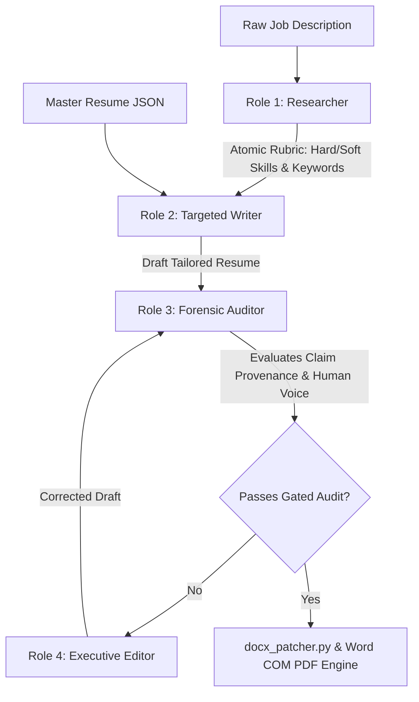
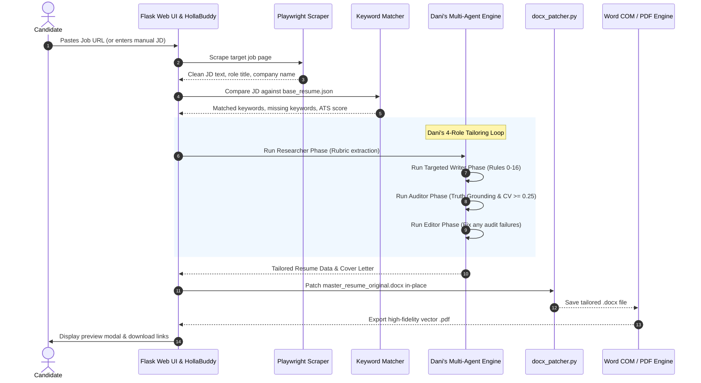

# 🚀 ATS Career Copilot: Autonomous Dual ATS & HR Optimization Engine

[](https://www.python.org/)
[](https://aistudio.google.com/)
[](https://playwright.dev/)
[](#rule-0-candidate-truth-grounding)
[](#mathematical-anti-ai-rhythm--human-voice-audit)
[](LICENSE)

> **The first truth-grounded, multi-agent career copilot engineered to beat both automated ATS algorithms and cynical human recruiters—while strictly preserving your custom Word/Canva design in-place.**

---

## 📑 Table of Contents

- [💡 Why This Was Made](#-why-this-was-made)
  - [The ATS Double-Filter Dilemma](#the-ats-double-filter-dilemma)
  - [The Trap of Traditional "AI Resume Builders"](#the-trap-of-traditional-ai-resume-builders)
  - [The Mission](#the-mission)
- [⚡ How It's Different](#-how-its-different)
  - [Architectural Comparison Matrix](#architectural-comparison-matrix)
  - [Core Differentiators](#core-differentiators)
- [📸 Visual Product Tour](#-visual-product-tour)
  - [1. Autonomous Application Engine (Tab 1)](#1-autonomous-application-engine-tab-1)
  - [2. Universal In-Browser Document Inspector](#2-universal-in-browser-document-inspector)
  - [3. HollaBuddy 24/7 AI Wingman & Q&A Copilot](#3-hollabuddy-247-ai-wingman--qa-copilot)
  - [4. Master Resume Profile & Visual Editor (Tab 4)](#4-master-resume-profile--visual-editor-tab-4)
  - [5. Applications Vault & 1-Click Refinement Copilot (Tab 2)](#5-applications-vault--1-click-refinement-copilot-tab-2)
  - [6. AI Detection & Humanizer Studio (Tab 5)](#6-ai-detection--humanizer-studio-tab-5)
  - [7. Setup & Multi-Key Failover Pool (Tab 3)](#7-setup--multi-key-failover-pool-tab-3)
- [🏗️ System Architecture](#%EF%B8%8F-system-architecture)
- [🚀 Quick Start & How to Use](#-quick-start--how-to-use)
  - [Option A: 1-Click Windows Launcher (Recommended for Desktop)](#option-a-1-click-windows-launcher-recommended-for-desktop)
  - [Option B: Zero-Install Cloud / Remote Web Access](#option-b-zero-install-cloud--remote-web-access)
  - [Option C: Manual Terminal Setup](#option-c-manual-terminal-setup)
- [📘 Detailed Step-by-Step User Guide](#-detailed-step-by-step-user-guide)
  - [Step 1: Configure Your Master Profile](#step-1-configure-your-master-profile)
  - [Step 2: Launch a New Application](#step-2-launch-a-new-application)
  - [Step 3: Preview & Download in High Fidelity](#step-3-preview--download-in-high-fidelity)
  - [Step 4: Use the Cover Letter & Screening Q&A Suite](#step-4-use-the-cover-letter--screening-qa-suite)
  - [Step 5: Iterate via the 1-Click Refinement Copilot](#step-5-iterate-via-the-1-click-refinement-copilot)
  - [Step 6: Chat with HollaBuddy Anytime](#step-6-chat-with-hollabuddy-anytime)
  - [Step 7: Audit External Text in the AI Lab](#step-7-audit-external-text-in-the-ai-lab)
- [🛡️ Privacy, Multi-User Isolation & Security](#%EF%B8%8F-privacy-multi-user-isolation--security)
- [❓ Frequently Asked Questions (FAQ)](#-frequently-asked-questions-faq)

---

## 💡 Why This Was Made

### The ATS Double-Filter Dilemma

Job hunting in the modern era is brutal. Every application passes through two distinct, opposing hurdles:

```
[ Your Application ]
         │
         ▼
 ┌───────────────┐      ❌ 75%+ of Resumes Dropped Here
 │ 1. ATS PARSER │ ───► Filtered out by algorithmic keyword scoring
 └───────┬───────┘      (Workday, Greenhouse, Lever, Taleo, Ashby)
         │ Passes keyword check
         ▼
 ┌───────────────┐      ❌ Instant Rejection
 │ 2. HUMAN EYE  │ ───► Generic AI buzzwords ("spearheaded", "tapestry",
 └───────┬───────┘      identical bullet lengths, destroyed templates)
         │ Impresses human
         ▼
 [ INTERVIEW CALLBACK ]
```

1. **The Machine (Applicant Tracking System - ATS)**: Systems like Workday, Greenhouse, Lever, and Taleo parse your document against the job description (JD). If you lack exact semantic keywords, technologies, and phrasing, your resume is discarded before a human ever looks at it.
2. **The Human Recruiter / Hiring Manager**: If your resume passes the ATS, an experienced hiring manager reads it for 6 to 10 seconds. In 2026, recruiters instantly spot robotic ChatGPT copy: monotonous sentence rhythms, cliché openers (*"spearheaded"*, *"leveraged"*, *"orchestrated"*), fluffy filler (*"testament to innovation"*), and destroyed layouts.

### The Trap of Traditional "AI Resume Builders"

Almost all existing AI resume tools fail catastrophically in one of three ways:

| The Trap | What Typical AI Tools Do | The Real-World Consequence |
|:---|:---|:---|
| **Hallucination** | Injects fake credentials, exaggerated metrics, or made-up technologies you've never used. | You are caught flat-footed and humiliated during technical interviews. |
| **Design Destruction** | Destroys your carefully crafted Word or Canva template and forces you into an ugly, generic single-column layout. | Your application looks like an automated template mill; recruiters immediately notice. |
| **Robotic "AI Voice"** | Generates bullets of identical length with predictable sentence structures, tripping AI detectors (ZeroGPT, GPTZero, CopyLeaks). | Recruiters reject your submission for lack of authentic human effort. |

### The Mission

**ATS Career Copilot** was created to eliminate this compromise forever. It delivers **dual optimization**:
- **100% Truth-Grounded**: Rule 0 ensures every claim, company, and metric originates strictly from your authentic master resume.
- **In-Place Template Surgery**: Patches your original Word or Canva `.docx` file in-place, preserving your exact fonts, margins, colors, and styling.
- **Scientific Human Voice**: Enforces strict burstiness ($CV \ge 0.25$), eliminates 50+ banned AI clichés, and validates sentence rhythm before generating files.
- **Complete Application Suite**: Delivers an ATS-optimized resume, custom cover letter, company-specific screening Q&A, and a 24/7 AI wingman in under 15 seconds.

---

## ⚡ How It's Different

### Architectural Comparison Matrix

| Feature / Capability | Generic ChatGPT / Claude | Traditional Resume Builders | **ATS Career Copilot** |
|:---|:---:|:---:|:---:|
| **Candidate Truth Grounding (Rule 0)** | ❌ Hallucinates fake metrics & jobs | ❌ User must manually type everything | ✅ **Strict provenance: Zero hallucinations** |
| **In-Place Template Preservation** | ❌ Outputs raw markdown / plain text | ❌ Restricts you to their rigid templates | ✅ **100% in-place XML surgery on your `.docx`** |
| **Anti-AI Detection Audit** | ❌ Riddled with AI tells & buzzwords | ❌ None | ✅ **$CV \ge 0.25$ burstiness & 50+ banned words** |
| **Job Scraping Integration** | ❌ Requires manual copy-paste | ❌ Mostly manual | ✅ **Automated Playwright scraper (10+ ATS platforms)** |
| **Multi-Agent Pipeline** | ❌ Single generic prompt | ❌ Static string replacement | ✅ **4-Role Team: Researcher, Writer, Auditor, Editor** |
| **Complete Application Package** | ❌ Resume only | ❌ Paywalled add-ons | ✅ **Tailored Resume + Cover Letter + Screening Q&A** |
| **In-Browser High-Fidelity PDF Preview**| ❌ None | ❌ Low-res watermark | ✅ **Instant vector PDF inspector before downloading** |
| **24/7 Contextual Chat Copilot** | ❌ Forgets context between prompts | ❌ None | ✅ **HollaBuddy: Anchored in your master profile** |
| **Cost & Data Privacy** | 💳 $20+/month; logs your data | 💳 Expensive subscriptions | 🆓 **100% Free Tier (Gemini Flash); 100% Local Privacy** |

---

### Core Differentiators

#### 1. Rule 0: Candidate Truth Grounding
Traditional generative AI hallucinates. ATS Career Copilot operates under an inviolable architectural contract: **Rule 0**.
- The AI is **forbidden** from inventing companies, dates, degrees, certifications, or metrics.
- Every tailored bullet point must trace its provenance directly to an experience or project present in your `base_resume.json`.
- Missing target keywords are woven naturally into real, existing achievements—never fabricated from thin air.

#### 2. In-Place Word & Canva Template Preservation (`docx_patcher.py`)
Unlike web builders that force you into their predefined templates, ATS Career Copilot performs surgical in-place XML run patching on your existing `.docx` file:
- Retains your exact typography (Serif, Sans, custom branding).
- Preserves font sizes, weights (bold, regular), text colors, margins, and column layouts.
- Handles headers, bullet formatting, and structural dividers seamlessly.
- Converts to true vector `.pdf` via Microsoft Word COM automation (with zero layout shifts).

#### 3. Dani's 4-Role Multi-Agent Engine (`danis_engine.py`)
Instead of a single monolithic prompt, the tailoring pipeline runs an autonomous 4-stage multi-agent loop:



1. **The Researcher**: Deconstructs the job description into atomic hard requirements, soft requirements, core competencies, and high-priority ATS acronyms.
2. **The Writer**: Drafts tailored bullets front-loading measurable impact and plain action verbs while observing Rules 0–16.
3. **The Auditor**: An independent gatekeeper that performs a Claim Provenance Audit (checking for hallucinations) and a Human Voice Audit.
4. **The Editor**: Selectively rewrites any specific bullet that failed the audit until it achieves full compliance.

#### 4. Mathematical Anti-AI Rhythm & Human Voice Audit
The system enforces strict mathematical constraints on generated text to defeat AI detectors and fatigue-ridden recruiters:
- **Burstiness (Sentence Rhythm)**: Requires a Coefficient of Variation ($CV = \sigma / \mu$) of bullet lengths $\ge 0.25$. Humans naturally vary sentence length (short punchy bullets mixed with complex technical accomplishments); AI writes monotonously uniform lengths.
- **Bullet Length Cap**: Hard cap of $\le 28$ words per bullet (mean $\le 24$ words) to prevent verbose, fluffy paragraphs.
- **Summary Constraints**: $\le 3$ sentences, $\le 70$ words, and zero formulaic openers (*"results-driven professional"*).
- **Blacklisted Lexicon**: Eliminates 50+ dead giveaways including *delve*, *tapestry*, *robust*, *seamless*, *multifaceted*, *holistic*, *synergy*, *pivotal*, *testament*, and *transformative*.

---

---

## 📸 Interactive Product Tour & System Surfaces

### 1. Autonomous Application Engine (Tab 1)

Paste any job posting URL or raw JD text. In under 15 seconds, the engine scrapes the posting, identifies critical keyword gaps, runs Dani's multi-agent tailoring pipeline, and outputs an ATS-optimized `.docx` and vector `.pdf`.

```
┌─────────────────────────────────────────────────────────────────────────────┐
│ ⚡ AUTONOMOUS RESUME TAILORING PIPELINE                                      │
│ Cross-check ATS keywords and tailor your resume in seconds.                │
│                                                                             │
│ [ 🔗 https://jobs.lever.co/company/data-engineer-role                     ] │
│                                  [ 🔍 Analyze & Cross-Check ] [ ⚡ Generate ]│
├──────────────────────┬──────────────────────────┬───────────────────────────┤
│ 👤 MASTER RESUME      │ 🤖 4-AGENT PIPELINE      │ 🎯 DUAL-GATE VERIFICATION │
│ Synced from ground   │ Researcher → Writer →    │ Semantic keyword matching │
│ truth profile        │ Auditor → Editor         │ + 100% recruiter clean    │
│ [Alex_Morgan.docx]   │ [Gemini 2.5 Flash Active]│ [Score: 94% (+22% delta)] │
└──────────────────────┴──────────────────────────┴───────────────────────────┘
```

> **Key Capabilities**:
> - **Live Job Scraper**: Instant extraction from LinkedIn, Lever, Greenhouse, Workday, Ashby, Wellfound, SmartRecruiters, and iCIMS.
> - **Manual JD Modal**: Paste raw JD text directly for private or unlisted job openings.
> - **Dynamic Match Scoring**: Real-time breakdown of matched vs. missing hard and soft skills.
> - **Tri-Asset Generation**: Simultaneously crafts your tailored resume, customized cover letter, and screening Q&A.

---

### 2. Universal In-Browser Document Inspector

Never download a file blindly. Inspect your tailored resume in full vector fidelity inside the browser before saving it to your device.

```
┌─────────────────────────────────────────────────────────────────────────────┐
│ 👁️ DOCUMENT INSPECTOR — Tailored Resume Vector Preview                       │
│ [ 📄 Download DOCX ]   [ 📥 Download PDF ]   [ ↗ New Tab ]   [ ✕ Close (Esc) ]│
├─────────────────────────────────────────────────────────────────────────────┤
│                                                                             │
│                             ALEX MORGAN                                     │
│                            Data Engineer                                    │
│                 alex.morgan@example.com | San Francisco, CA                 │
│                                                                             │
│  PROFESSIONAL SUMMARY                                                       │
│  Senior Data Engineer with 8 years architecting scalable cloud pipelines... │
│                                                                             │
│  TECHNICAL SKILLS                                                           │
│  • Cloud & Architecture: AWS, GCP, BigQuery, Snowflake, Databricks, Kafka  │
│  • Engineering & Data: Python, PySpark, SQL, dbt, Airflow, CI/CD, Docker    │
│                                                                             │
│  PROFESSIONAL EXPERIENCE                                                    │
│  Senior Data Engineer | Apex Cloud Systems                    2021 – Present│
│  • Architected medallion lakehouse ingesting 100k+ records per hour...      │
│  • Implemented automated CI/CD reducing deployment cycle from 2 days to 30m│
│                                                                             │
└─────────────────────────────────────────────────────────────────────────────┘
```

> **Key Capabilities**:
> - **Zero-Download Verification**: Review typography, layout balance, page boundaries, and formatting directly in the modal.
> - **One-Click Downloads**: Dedicated action buttons for both Microsoft Word (`.docx`) and Vector Adobe Acrobat (`.pdf`).
> - **Keyboard Accessible**: Close instantly with the `Esc` key or the top-right dismiss button.

---

### 3. HollaBuddy 24/7 AI Wingman & Q&A Copilot

Click the cute **HollaBuddy** icon in the bottom-right corner anytime to summon your personal career wingman. HollaBuddy is permanently grounded in your master resume profile.

```
┌─────────────────────────────────────────────────────────────────────────────┐
│ 🤖 HollaBuddy | Career Wingman & Copilot                         [ — ] [ ✕ ]│
├─────────────────────────────────────────────────────────────────────────────┤
│ 🤖 HollaBuddy:                                                              │
│ Here is a copy-ready response connecting your real experience with the role:│
│                                                                             │
│ ┌─────────────────────────────────────────────────────────────────────────┐ │
│ │ > At Apex Cloud Systems, I led the migration of clinical data pipelines │ │
│ │ > to a medallion architecture, reducing batch latency by 40% while      │ │
│ │ > enforcing strict HIPAA and HITRUST compliance. My experience owning   │ │
│ │ > bronze-to-gold transforms makes me well-prepared to drive your core   │ │
│ │ > data platforms forward from day one.                                  │ │
│ └─────────────────────────────────────────────────────────────────────────┘ │
│ [ 📋 Copy Answer ]                                                          │
├─────────────────────────────────────────────────────────────────────────────┤
│ [ Ask HollaBuddy any application question, pitch prompt, or salary advice... ]
│ 32 words · 210 characters                     [ ⛶ Expand ]  [ 🚀 Send ]      │
└─────────────────────────────────────────────────────────────────────────────┘
```

> **Key Capabilities**:
> - **Dynamic Auto-Expanding Editor**: Smoothly scales from a compact single line (40px) up to 220px as you paste lengthy job application prompts.
> - **Live Character & Word Counters**: Real-time counter badge ensures your answers fit strict ATS portal constraints (e.g., *"maximum 250 words"*).
> - **Full-View Modal Expansion**: Click the expand button to write in an expansive distraction-free editor.
> - **STAR Behavioral Answer Generator**: Instantly transforms tricky behavioral interview questions (*"Tell me about a time you failed"*, *"Why should we hire you?"*) into structured, metric-backed answers grounded in your authentic work history.
> - **Clean Markdown Blockquotes**: Delivers clean, copy-ready answers with standard proportional fonts—never garbled monospace ASCII splits.
> - **One-Click Answer Copy**: Copy polished responses directly into application portals with a single click.

---

### 4. Master Resume Profile & Visual Editor (Tab 4)

Your single source of truth. Manage your contact details, work experience, hard and soft skills, education, and project portfolio through an intuitive visual interface or raw JSON.

> **Key Capabilities**:
> - **Visual Experience Manager**: Easily add, edit, or reorder roles, companies, dates, and bullet achievements.
> - **Categorized Skill Taxonomy**: Separate languages, cloud infrastructure, databases, frameworks, and methodologies.
> - **Synchronized Dual-Mode Editing**: Toggle between the clean visual form and the raw JSON editor with instant two-way synchronization.
> - **Reset to Default**: Instantly restore a clean master template at any time.

---

### 5. Applications Vault & 1-Click Refinement Copilot (Tab 2)

A comprehensive archive of every application you've ever created, complete with instant file reloads, audit logs, and an interactive refinement copilot.

> **Key Capabilities**:
> - **Application Vault**: Search, view, and manage all previous applications organized by company and role.
> - **1-Click Refinement Copilot**: Need a tweak? Give natural language instructions (*"Make the bullets more concise"*, *"Emphasize GCP and BigQuery over AWS"*, *"Add quantitative metrics to role 2"*) and watch the engine re-patch your resume in seconds.
> - **Audit Trail & Logs**: View execution logs and inspect exactly which keywords were added during each run.

---

### 6. AI Detection & Humanizer Studio (Tab 5)

Test any piece of text (resume bullets, cover letter paragraphs, LinkedIn messages) against industry-standard AI detection patterns and humanize it with a single click.

> **Key Capabilities**:
> - **Multi-Signal AI Scoring**: Calculates synthetic probability based on vocabulary, syntax uniformity, and cliché frequency.
> - **Burstiness Analyzer ($CV$)**: Displays the exact Coefficient of Variation of your sentence lengths (targeting $CV \ge 0.25$).
> - **Cliché Highlighter**: Flags overused AI terms (*"spearheaded"*, *"seamless"*, *"pivotal"*, *"delve"*).
> - **One-Click Humanizer**: Automatically rewrites flagged text using natural human cadence and active voice.

---

### 7. Setup & Multi-Key Failover Pool (Tab 3)

Manage your API keys, test browser automation prerequisites, and configure multi-key failover to ensure uninterrupted operation.

> **Key Capabilities**:
> - **One-Click Key Validation**: Instantly tests your Google Gemini API key and reports model availability.
> - **Multi-Key Rotation Pool**: Add multiple free Gemini keys. The client automatically rotates across keys with round-robin failover to bypass rate limits (`429 Quota Exceeded`).
> - **Playwright Status Check**: Verifies Chromium browser readiness for headless JD scraping.

---

## 🏗️ System Architecture

The following diagram illustrates the end-to-end data flow from job posting to final application assets:



---

## 🚀 Quick Start & How to Use

### Option A: 1-Click Windows Launcher (Recommended for Desktop)

If you are running on Windows, getting started takes literally one double-click:

1. Clone or download this repository to your computer.
2. Double-click **`Start_Agent.bat`**.
3. The script will automatically:
   - Verify your Python installation (Python 3.10+ recommended).
   - Create an isolated virtual environment (`venv`).
   - Install all required dependencies from `requirements.txt`.
   - Install Playwright Chromium for scraping.
   - Launch the local web server at `http://127.0.0.1:5000` and open your default browser.
4. Navigate to **Tab 3 (Setup)**, paste your free [Gemini API Key](https://aistudio.google.com/), and click **Save & Test Key**. You're ready!

---

### Option B: Zero-Install Cloud / Remote Web Access

You can host ATS Career Copilot on a home server, VPS, or cloud instance and share it with friends, family, or clients **without them having to install Python or batch files**:

```
[ Host Machine (Runs Python, Playwright, Word COM) ]
                       │
             [ Cloudflare Tunnel / Tailscale / Ngrok ]
                       │
                       ▼
      https://ats-copilot.yourdomain.com
                       │
       ┌───────────────┴───────────────┐
       ▼                               ▼
[ Remote User on Mac ]       [ Remote User on Mobile ]
(Zero installation needed;   (Inspects & downloads PDFs;
 runs 100% in browser)        uses HollaBuddy copilot)
```

1. Run the agent on your host machine using `python app.py`.
2. Expose port 5000 using Cloudflare Tunnel (`cloudflared tunnel --url http://localhost:5000`) or your preferred reverse proxy.
3. Remote users simply open the URL in Chrome, Safari, or Edge. They can create accounts, edit their master resumes, tailor applications, and download files directly from the web interface.

---

### Option C: Manual Terminal Setup

For macOS, Linux, or developers who prefer using the terminal:

```bash
# 1. Clone the repository
git clone https://github.com/your-username/ATS-agent.git
cd ATS-agent

# 2. Create and activate a virtual environment
python -m venv venv
# On Windows:
venv\Scripts\activate
# On macOS/Linux:
source venv/bin/activate

# 3. Install dependencies & browser binaries
pip install -r requirements.txt
playwright install chromium

# 4. Copy the environment template
cp .env.example .env

# 5. Launch the application
python app.py
```

Open `http://127.0.0.1:5000` in your browser.

---

## 📘 Detailed Step-by-Step User Guide

### Step 1: Configure Your Master Profile
1. Click **Tab 4 (Master Resume Profile)**.
2. Fill out your full name, contact information, LinkedIn URL, and portfolio.
3. Add your authentic work history: role title, company name, location, dates, and bullet points detailing what you actually accomplished.
4. Populate your technical skills categorized by language, framework, database, and cloud tool.
5. Click **Save Resume**. This profile serves as your permanent ground truth.

> [!TIP]
> You can also import your existing resume by placing `Resume.pdf` in the root folder and running `python pdf_to_resume.py` to auto-generate `base_resume.json`.

---

### Step 2: Launch a New Application
1. Click **Tab 1 (New Application)**.
2. Paste the URL of the job posting you want to apply for (LinkedIn, Greenhouse, Lever, Workday, etc.).
   - *If the posting is behind a login or on an unlisted board, click **Paste Manually** to paste the raw text.*
3. Click **Analyze & Tailor Resume**.
4. The system will:
   - Scrape the job description in headless Chromium.
   - Extract hard requirements, soft requirements, and target keywords.
   - Execute Dani's 4-role multi-agent engine.
   - Patch your original Word template in-place.
   - Convert the `.docx` into a vector `.pdf`.
   - Generate a custom, high-converting cover letter and company screening Q&A.

---

### Step 3: Preview & Download in High Fidelity
1. When the run finishes, click **👁️ Preview Resume**.
2. The **Universal In-Browser Document Inspector** pops up, rendering the exact vector PDF.
3. Check your margins, formatting, and keyword placement.
4. Click **Download Word (.docx)** or **Download PDF (.pdf)** to save the files to your device.

---

### Step 4: Use the Cover Letter & Screening Q&A Suite
1. Scroll down on the results page to view your generated **Cover Letter**. It matches the tone of your resume and references specific challenges mentioned in the job description.
2. Switch to the **Screening Q&A** tab to review answers to common questions employers ask during the application submission process (e.g., *"Why do you want to work at [Company]?"*, *"Describe your experience with distributed data systems"*).

---

### Step 5: Iterate via the 1-Click Refinement Copilot
1. Go to **Tab 2 (Applications History)**.
2. Find the application card you want to adjust.
3. Click **Refine / Edit**.
4. Type your instruction in plain English:
   - *"Make the summary more concise and punchy."*
   - *"Shift emphasis from AWS to Google Cloud Platform."*
   - *"Shorten the bullets in my most recent role to fit on exactly one page."*
5. Click **Apply Refinement**. The engine re-executes the auditor loop, updates the `.docx` and `.pdf`, and refreshes the preview.

---

### Step 6: Chat with HollaBuddy Anytime
1. Click the **HollaBuddy** badge at the bottom-right corner of your screen.
2. Paste any question from an application form, a recruiter's email, or an upcoming interview:
   - *"How should I answer: 'What is your biggest weakness when managing cloud pipelines?'"*
   - *"Write a 150-word note to the hiring manager on LinkedIn."*
   - *"Explain my experience with Kafka as if I'm speaking to a non-technical director."*
3. Watch the textarea dynamically expand as you type or paste text. Monitor word and character counts in real time.
4. Click **Send** to receive a tailored, metric-backed answer grounded in your resume profile, and copy it with one click.

---

### Step 7: Audit External Text in the AI Lab
1. Click **Tab 5 (AI Lab)**.
2. Paste any text snippet into the input box.
3. Click **Run AI Detection Audit**.
4. Review the burstiness score ($CV$), average bullet length, and highlighted AI clichés.
5. Click **Humanize Text** to rewrite the prose with authentic human variance.

---

## 🛡️ Privacy, Multi-User Isolation & Security

Your career data is sensitive. ATS Career Copilot is designed from the ground up with a **privacy-first architecture**:

- **100% Local Storage**: All profiles, generated documents, and application histories are stored locally on your machine.
- **Zero Third-Party Telemetry**: We do not collect analytics, track your IP address, or transmit your resume to external servers.
- **Direct API Communication**: The only external calls are made directly from your machine to Google's official Gemini API endpoint using your private key.
- **Multi-User Isolation**: Each user account gets an isolated sandbox directory (`users/<username>/`) preventing data leaks in multi-user environments.
- **Git Shielding**: Sensitive files (`.env`, `base_resume.json`, user application folders, cache files, and logs) are strictly excluded from version control via `.gitignore`.

---

## ❓ Frequently Asked Questions (FAQ)

### Is it really 100% free to run?
**Yes.** Google provides a generous free tier for the Gemini 1.5 / 2.5 / 3.5 Flash models (1,500 free requests per day, no credit card required). Each complete application run uses approximately 3 to 4 calls. You can comfortably generate dozens of tailored applications every single day at zero cost.

### Can I use my own custom resume template?
**Absolutely.** That is one of the system's flagship features. Place your custom Microsoft Word file as `master_resume_original.docx` in the root folder. The `docx_patcher.py` engine will read its formatting (fonts, colors, sizes, line spacing, margins) and patch your tailored content directly into that design.

### What if I don't have Microsoft Word installed on my system?
If Microsoft Word is not installed (e.g., on a Linux/macOS server), the system generates the tailored `.docx` document and uses an open-source headless conversion fallback (LibreOffice or PDFKit) to render the `.pdf`. If Word is installed on Windows, it uses Word COM automation for 100% pixel-perfect vector fidelity.

### How does the multi-key failover pool work?
Google's free API tier enforces a limit of 15 requests per minute. If you submit multiple applications rapidly, a single key may return a `429 Quota Exceeded` error. In **Tab 3 (Setup)**, you can enter multiple Gemini API keys separated by commas. The system rotates through them using round-robin scheduling and automatically switches keys if one hits a temporary rate limit.

### Does the system work on jobs that require a login (like LinkedIn)?
Yes. For job posts behind authentication walls, simply click the **Paste Manually** button in Tab 1, paste the text of the job description into the modal, and the pipeline will execute identically.

---

## 📄 License & Attribution

This project is licensed under the MIT License. You are free to modify, distribute, and use it for personal or commercial career applications.

*Built with ❤️ for job seekers everywhere. Never let an algorithm reject you again.*
